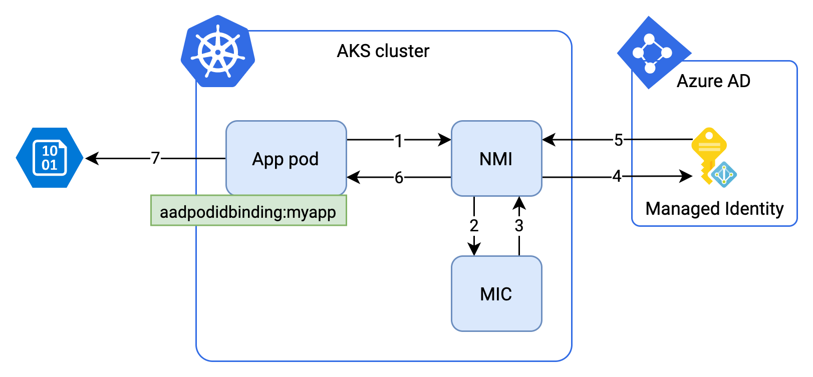
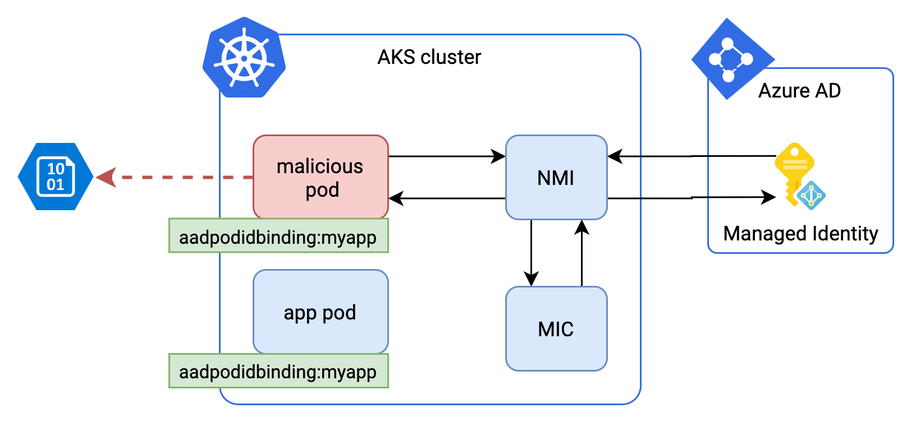

# The right way of accessing Azure services from inside your Azure Kubernetes Cluster

Often applications running on Azure need to access other Azure resources, like storage accounts, CosmosDB or, KeyVault instances. When it seems like an easy task using [managed identities](https://docs.microsoft.com/en-us/azure/active-directory/managed-identities-azure-resources/overview), it gets a little bit more complicated in the context of the AKS cluster. Nodes are shared across different pods, and we need to keep fine-grained access policies at the pod level rather than the node level.


If you are coming from AWS space, you might be aware of projects like [Zalando's IAM controller for K8S](https://github.com/zalando-incubator/kube-aws-iam-controller) or [kiam](https://github.com/uswitch/kiam). Azure has [AAD Pod Identity](https://github.com/Azure/aad-pod-identity/) which, you can consider equivalent to the projects mentioned above.

In this article, I walk you through the process of setting up  Azure Access Directory Pod Identities inside your cluster. The article is split into four parts

 - The problem we want to solve
 - Concepts behind AAD Pod Identity
 - Security
 - Deployment steps


## Problem

Let's say a pod with an application X needs to have read access to data inside a blob storage container. There are several ways of achieving this, examples are:
 -  `EnvironmentCredential`

    Will read environment variables and then authenticate as a service principal or a user.

    ```python
    from azure.identity import EnvironmentCredential

    credential = EnvironmentCredential()
    client = BlobServiceClient(account_url, credential=credential)
    ```

 - Storage Account Keys

    Think about it as a root password to your storage account. You probably don't want to risk using it in any of your applications. (I won't even show you a code example :))

 - SAS Token (Shared Access Signature)

    A string that you can provide to your application to grant granular temporary access to storage resources: e.g., container, single blob.
    ```python
    from azure.storage.blob import BlockBlobService

    token = "?sv=2019-02-02&ss=b&srt=co&sp=r&se=2020-03-19T00:50:10Z&st=2020-03-18T16:50:10Z&spr=https&sig=XXX%3D"

    blob_service = BlockBlobService(
        account_name="storagaccountname",
        sas_token=token,
    )
    ```

Each of these options requires us to have a certain value like the token above, or environmental variables set on the target machine. Those values could be defined inside the container image, injected as a K8S secret, or maybe set as env variable in the deployment YAML. For a token, we need to make sure we rotate it regularly; env variables need to be delivered to target pod. 

Ideally, we would like to get rid of this requirement and use something that streamlines the whole process. We want to:

 - make sure our application access only necessary resources
 - apply none or minimal code changes to our application
 - get an access token automatically, rather than using fixed credentials
 - the token should have its life span and be valid only for our application
 - the token should be rotated automatically


 
## How does it work

#### Managed identities 

Managed identity allows authenticating to any service that supports Azure AD authentication without attaching credentials to your application. Once the identity is created, you need to attach a role that defines what the identity can do with a particular resource.

Let's have a look at the sample code:

```python
from azure.identity import ManagedIdentityCredential

credential = ManagedIdentityCredential()
client = BlobServiceClient(account_url, credential=credential)
```
It looks almost like the `EnvironmentCredential` example above, but there is one subtle difference. `ManagedIdentityCredential` creates an access token in real-time without any additional data attached to your app as opposed to `EnvironmentCredential` that requires you to set env variables with secrets.

#### AAD Pod Identity

When you deploy AAD Pod Identity to your cluster, you get two components:
 -  Managed Identity Controller (MIC)

    A pod that watches for changes and when detects a relevant one (e.g., pod or identity bindings modified) attaches or removes assigned identities.

 -  Node Managed Identity (NMI)

    A Daemon set which hijacks each call of `ManagedIdentityCredential` to node metadata.


####  Under the hood



1. Inside your pod, the `ManagedIdentityCredential` instance sends a request to Azure Instance Metadata Service (IMDS)
    ```
    http://169.254.169.254/metadata/identity/oauth2/token
    ```
2. The request gets intercepted by the NMI. The NMI then checks which identity is assigned to the source pod by querying the MIC
3. The MIC checks for Azure identity mappings in your AKS cluster. If such exists, it returns it to the NMI
4. The NMI server requests an access token from AD based on the pod's identity mapping returned in the step above
5. AD passes the token to the NMI
6. The NMI transfers the token to the app
7. The app queries Azure service using the token


## Security

Before we deploy anything, it is vital to understand the potential security risks behind it.
#### Reusing selector binding


MIC identifies pods by `aadpodidbinding` label. If any other pod in the cluster reuses `aadpodidbinding` it also accesses to the associated identity binding. For a cluster with a single project, it's unlikely to happen, but still, you need to be cautious, especially if the cluster is logically shared across teams/projects.

By default, AAD Pod Identity maps pods with identities across namespaces. If the cluster is shared, it is crucial to deploy AAD Pod Identities, [forcing namespace matching](https://github.com/Azure/aad-pod-identity/blob/master/docs/readmes/README.namespaced.md).


#### NMI intercepts all connections to the instance metadata endpoint

By default, the NMI component captures all requests to IMDS inside your cluster. That might not be sufficient for some of the use cases. The easiest way to is to create `AzurePodIdentityException` resource in the cluster:

```yaml
apiVersion: "aadpodidentity.k8s.io/v1"
kind: AzurePodIdentityException
metadata:
  name: aad-identity-exception
spec:
  PodLabels:
    noaad: true
```

Then, for every app we don't want to use AAD Pod Identity, we simply specify `spec.template.metadata.labels` to `noaad: true`. Of course, you can use your custom label.


## Installing AAD Pod Identity

### 1. Deploy aad-pod-identity to your cluster

Run the following command:
```bash
kubectl apply -f https://raw.githubusercontent.com/Azure/aad-pod-identity/master/deploy/infra/deployment-rbac.yaml
```
Note that the deployment will go to the `default` namespace.


### 2. Create a new managed identity and assign a role to it

```bash
az identity create -g "<your_resource_group>" -n "<your_managed_identity_name>"
```

The command should return the following:
```json
{
  "clientId": "00000000-0000-0000-0000-000000000000",
  "clientSecretUrl": "https://control-westeurope.identity.azure.net/subscriptions/00000000-0000-0000-0000-000000000000/resourcegroups/<your_resource_group>/providers/Microsoft.ManagedIdentity/userAssignedIdentities/<your_managed_identity_name>/credentials?tid=00000000-0000-0000-0000-000000000000&oid=00000000-0000-0000-0000-000000000000&aid=00000000-0000-0000-0000-000000000000",
  "id": "/subscriptions/00000000-0000-0000-0000-000000000000/resourcegroups/myresourcegroup/providers/Microsoft.ManagedIdentity/userAssignedIdentities/<your_managed_identity_name>",
  "location": "westeurope",
  "name": "<your_managed_identity_name>",
  "principalId": "00000000-0000-0000-0000-000000000000",
  "resourceGroup": "<your_resource_group>",
  "tags": {},
  "tenantId": "00000000-0000-0000-0000-000000000000",
  "type": "Microsoft.ManagedIdentity/userAssignedIdentities"
}
```

Now it's time to assign a role. Here I'm using `Storage Blob Data Reader`. This will enable reading data from a blob storage account:
```bash
az role assignment create --role "Storage Blob Data Reader" --assignee "<the managed identity id returned previously>" --scope "<your resource id>"
```

*Hint 1*: You can find more roles [here](https://docs.microsoft.com/en-us/azure/role-based-access-control/built-in-roles). If you are looking for something more specific you might [want to create a custom role](https://docs.microsoft.com/en-us/azure/role-based-access-control/custom-roles).

*Hint 2*: If you don't know your resource id you can fetch it using:
```bash
az resource list
```


### 3. Create an Azure identity in you cluster
Create a file `aadpodidentity.yaml` with the following content:
```yaml
apiVersion: "aadpodidentity.k8s.io/v1"
kind: AzureIdentity
metadata:
  name: <your_managed_identity_name>
spec:
  type: 0
  ResourceID: <the managed identity id returned previously>
  ClientID: <the managed identity clientId returned previously>
```

Apply it:         
```
kubectl apply -f aadpodidentity.yaml
```

### 4. Bind the Azure Identity to your pod selector

Create another manifest file named `aadpodidentitybinding.yaml`:
```yaml
apiVersion: "aadpodidentity.k8s.io/v1"
kind: AzureIdentityBinding
metadata:
  name: myapp-azure-identity-binding
spec:
  AzureIdentity: <your_managed_identity_name from the previous step>
  Selector: <your_app_selector_name>
```

Deploy it
```bash
kubectl apply -f aadpodidentitybinding.yaml
```

Now the MIC knows that, whenever a pod with a particular selector appears in the cluster, it needs to bind the previously created identity to it.

### 5. Managed Identity Controller (MIC) permissions

The MIC needs to read information about the managed identity we just created. Since it is using AKS service principal to query Azure resources we need to assign a specific role to our AKS service principal.

First of all, you need to find the service principal id:
```bash
az aks show -g "<aks_resource_group>" -n "<aks_cluster_name>" --query servicePrincipalProfile.clientId -o tsv
```

Now simply assign the `Managed Identity Operator` role to the AKS service principal:
```bash
az role assignment create --role "Managed Identity Operator" --assignee "<result of the previous command>" --scope "<the “id” field of az identity create command executed previously>"
```

### 6. Update your deployment manifest

The last step is to update your deployment manifest. In the `spec.template.metadata.labels` add a new label called `aadpodidbinding` with the selector name you've chosen in step 4.

```yaml
apiVersion: apps/v1
kind: Deployment
metadata:
  name: myapp
spec:
  template:
    metadata:
      labels:
        aadpodidbinding: <your_selector_name>
  ...
```

## Summary

Congratulations, you are ready to use your managed identities with apps running inside your AKS cluster. 

I hope you find this useful. Let me know if you have any questions or like to hear about some other topics.


